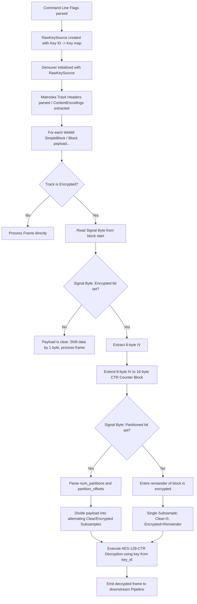

# Shaka Packager WebM CENC Raw Key Decryption Analysis & Go Implementation

This document provides a comprehensive, deep-dive analysis of how **Shaka Packager** implements Common Encryption (CENC) decryption for WebM media streams when using the `--enable_raw_key_decryption` flag. Following the analysis, we provide a complete, clean, and robust implementation in **Go (Golang)** that replicates this exact behavior, showing how to parse WebM block-level encryption metadata and decrypt the payload using AES-128-CTR.

---

## 1. WebM CENC Decryption Workflow in Shaka Packager

When Shaka Packager is executed with `--enable_raw_key_decryption` and a set of keys via `--keys`, it performs decryption at three levels: **Argument/Key Initialization**, **Track-level Header Parsing**, and **Block-level Frame Decryption**.



### Step 1.1: Initialization & Key Sourcing
- Command-line arguments `--enable_raw_key_decryption` and `--keys` (or deprecated `--key_id` and `--key`) are parsed by `ValidateRawKeyCryptoFlags()` and `GetRawKeyParams()` inside [raw_key_encryption_flags.cc](file:///d:/WorkSpace/shaka-packager/packager/app/raw_key_encryption_flags.cc).
- If enabled, a `RawKeySource` is created. This serves as a local key registry holding a map of 16-byte `KeyID` strings to their corresponding 16-byte `Key` bytes.
- When creating the demuxer in [packager.cc](file:///d:/WorkSpace/shaka-packager/packager/packager.cc), this key source is registered:
  ```cpp
  demuxer->SetKeySource(std::move(decryption_key_source));
  ```

### Step 1.2: Track-Level EBML Header Parsing
To identify which WebM tracks are encrypted, the demuxer parses the EBML headers. Specifically, inside `/Segment/Tracks/TrackEntry`, it checks the `ContentEncodings` element:
- **ContentEncodingScope**: Must be `1` (indicates frame payloads are encrypted).
- **ContentEncodingType**: Must be `1` (indicates Encryption).
- **ContentEncAlgo**: Must be `5` (specifies AES-CTR).
- **ContentEncKeyID**: Contains the 16-byte `Key ID`.
- **AESSettingsCipherMode**: Must be `1` (specifies CTR mode).

If this metadata is found, the parser stores the `encryption_key_id` for that track. This signals the block parser that block payloads on this track will contain encryption headers.

### Step 1.3: Block-Level Frame Parsing (`webm_cluster_parser.cc`)
For every encrypted track, the payload of each `SimpleBlock` or `Block` element contains an encryption header prepended to the actual media data. The structure of this prepended header is:

| Field | Size | Condition | Description |
|---|---|---|---|
| **Signal Byte** | 1 byte | Always | Bit flags indicating frame encryption status. |
| **IV (Initialization Vector)** | 8 bytes | `SignalByte & 0x01` | The 8-byte AES-CTR IV for the block. |
| **Num Partitions** | 1 byte | `SignalByte & 0x02` | Number of subsample partition boundaries. |
| **Partition Offsets** | `Num Partitions * 4` bytes | `SignalByte & 0x02` | 32-bit big-endian integers specifying offsets. |

#### Parsing the Signal Byte:
- **Bit 0 (`0x01`) - `kWebMEncryptedSignal`**: If set, the frame is encrypted. If not set, the frame is completely clear. (Even clear frames on an encrypted track have a 1-byte Signal Byte equal to `0x00`).
- **Bit 1 (`0x02`) - `kWebMPartitionedSignal`**: If set, the frame uses **Subsample Encryption**. If not set, the entire frame payload is encrypted.

#### Extending the IV to a 16-byte CTR Counter Block:
WebM uses an 8-byte IV to save bandwidth. However, standard AES-CTR requires a 16-byte block size. Shaka Packager extends the 8-byte IV by appending 8 bytes of zeros:
$$\text{Counter Block} = [\text{IV}_{8\text{ bytes}}] \mathbin{\Vert} [0x00, 0x00, 0x00, 0x00, 0x00, 0x00, 0x00, 0x00]$$

#### Subsample Partitioning Logic:
If the partitioned bit (`0x02`) is set:
1. Read the number of partitions (`num_partitions`).
2. Read `num_partitions` big-endian 32-bit integers, representing offset boundaries inside the media payload.
3. Subsamples alternate between **Clear** and **Encrypted**, beginning with a clear block:
   - Subsample $0$: Clear bytes = `offset[0] - 0`.
   - Subsample $1$: Encrypted bytes = `offset[1] - offset[0]`.
   - Subsample $2$: Clear bytes = `offset[2] - offset[1]`.
   - ...and so on.
   - If `num_partitions` is odd, the last encrypted segment extends to the end of the payload.
   - If `num_partitions` is even, a final trailing clear segment is added to cover the rest of the payload.

### Step 1.4: Decryption Execution (`decryptor_source.cc`)
Once the subsamples are parsed, `DecryptorSource::DecryptSampleBuffer` performs the AES-CTR decryption:
- It queries the `RawKeySource` using the track's `Key ID` to retrieve the 16-byte decryption key.
- It initializes an AES-CTR cipher with the key and the extended 16-byte IV.
- It loops through the subsamples:
  - Copy `clear_bytes` directly to the output buffer.
  - Decrypt `cipher_bytes` using the AES-CTR stream, maintaining the cipher state across subsamples of the same frame.
  - Advance the read and write pointers.
- After processing all blocks in the cluster, the decrypted frames are passed into the multiplexer (muxer).

---

## 2. Go (Golang) Implementation of WebM CENC Decryption

Below is a complete, modular, and robust Go package that replicates Shaka Packager's WebM decryption process. It includes EBML block payload parsing, partition offset handling, IV extension, and AES-128-CTR decryption using Go's standard `crypto/aes` and `crypto/cipher` libraries.

### Go Source Code: `webmdec/decrypt.go`

```go
package webmdec

import (
	"crypto/aes"
	"crypto/cipher"
	"encoding/binary"
	"fmt"
)

// Constants matching WebM CENC specifications
const (
	WebMEncryptedSignal   = 0x01
	WebMPartitionedSignal = 0x02
	WebMIvSize            = 8
)

// Subsample represents a slice of media data containing clear and encrypted bytes.
type Subsample struct {
	ClearBytes  uint32
	CipherBytes uint32
}

// DecryptConfig holds the cryptographic parameters for a WebM block.
type DecryptConfig struct {
	KeyID      []byte
	IV         []byte // Extended 16-byte IV
	Subsamples []Subsample
}

// DecryptResult contains the decrypted frame data and the parsed configuration.
type DecryptResult struct {
	DecryptedData []byte
	Config        DecryptConfig
	IsEncrypted   bool
}

// ParseAndDecryptWebMBlock replicates the C++ WebMCreateDecryptConfig & DecryptSampleBuffer logic.
// - blockPayload: The raw byte slice containing the WebM block payload (starts with Signal Byte if encrypted).
// - keyID: The 16-byte key ID associated with the track.
// - key: The 16-byte decryption key.
func ParseAndDecryptWebMBlock(blockPayload []byte, keyID []byte, key []byte) (*DecryptResult, error) {
	if len(blockPayload) < 1 {
		return nil, fmt.Errorf("empty WebM block payload")
	}

	signalByte := blockPayload[0]
	headerSize := 1

	// Case 1: The frame is not encrypted (Signal Byte does not have the 0x01 bit set)
	if signalByte&WebMEncryptedSignal == 0 {
		// Frame is clear, but the 1-byte Signal Byte is still prepended.
		// Return the remainder of the payload as clear data.
		clearData := make([]byte, len(blockPayload)-1)
		copy(clearData, blockPayload[1:])
		return &DecryptResult{
			DecryptedData: clearData,
			IsEncrypted:   false,
		}, nil
	}

	// Case 2: Frame is encrypted
	headerSize += WebMIvSize
	if len(blockPayload) < headerSize {
		return nil, fmt.Errorf("block payload too small to contain IV")
	}

	// Extract 8-byte IV and extend to 16-byte Counter Block
	rawIV := blockPayload[1 : 1+WebMIvSize]
	extendedIV := make([]byte, 16)
	copy(extendedIV[:WebMIvSize], rawIV) // Extended with 8 bytes of trailing zeros

	var subsamples []Subsample
	var dataOffset int

	// Check if the frame uses Subsample Encryption (Partitioned)
	if signalByte&WebMPartitionedSignal != 0 {
		numPartitionsOffset := headerSize
		headerSize += 1 // 1 byte for num_partitions
		if len(blockPayload) < headerSize {
			return nil, fmt.Errorf("block payload too small to contain num_partitions")
		}

		numPartitions := int(blockPayload[numPartitionsOffset])
		partitionsStart := headerSize
		headerSize += numPartitions * 4 // 4 bytes for each partition offset

		if len(blockPayload) < headerSize {
			return nil, fmt.Errorf("block payload too small to contain partition offsets")
		}

		payloadSize := uint32(len(blockPayload) - headerSize)
		dataOffset = headerSize

		// Parse the partition offsets (each is a big-endian uint32)
		offsets := make([]uint32, numPartitions)
		for i := 0; i < numPartitions; i++ {
			idx := partitionsStart + (i * 4)
			offsets[i] = binary.BigEndian.Uint32(blockPayload[idx : idx+4])
		}

		// Convert partition offsets into Clear/Cipher Subsamples
		var prevOffset uint32 = 0
		for i := 0; i < numPartitions; i += 2 {
			clearOffset := offsets[i]
			if clearOffset < prevOffset {
				return nil, fmt.Errorf("partition offsets out of order")
			}
			clearSize := clearOffset - prevOffset

			var cipherSize uint32 = 0
			if i+1 < numPartitions {
				cipherOffset := offsets[i+1]
				if cipherOffset < clearOffset {
					return nil, fmt.Errorf("partition offsets out of order")
				}
				cipherSize = cipherOffset - clearOffset
				prevOffset = cipherOffset
			} else {
				// Last partition is odd, cipher size spans to the end of the payload
				if payloadSize < clearOffset {
					return nil, fmt.Errorf("partition offset exceeds payload size")
				}
				cipherSize = payloadSize - clearOffset
				prevOffset = payloadSize
			}

			subsamples = append(subsamples, Subsample{
				ClearBytes:  clearSize,
				CipherBytes: cipherSize,
			})
		}

		// Even number of partitions: add one last all-clear subsample
		if numPartitions%2 == 0 && prevOffset < payloadSize {
			subsamples = append(subsamples, Subsample{
				ClearBytes:  payloadSize - prevOffset,
				CipherBytes: 0,
			})
		}
	} else {
		// No partitioning: the entire remainder of the frame is encrypted
		dataOffset = headerSize
		payloadSize := uint32(len(blockPayload) - headerSize)
		subsamples = append(subsamples, Subsample{
			ClearBytes:  0,
			CipherBytes: payloadSize,
		})
	}

	encryptedMediaData := blockPayload[dataOffset:]
	decryptedMediaData := make([]byte, len(encryptedMediaData))

	// Execute AES-128-CTR Decryption
	block, err := aes.NewCipher(key)
	if err != nil {
		return nil, fmt.Errorf("failed to create AES cipher: %v", err)
	}

	stream := cipher.NewCTR(block, extendedIV)

	// Perform subsample decryption
	var srcOffset uint32 = 0
	for _, sub := range subsamples {
		// 1. Copy Clear Bytes
		if sub.ClearBytes > 0 {
			copy(decryptedMediaData[srcOffset:srcOffset+sub.ClearBytes], encryptedMediaData[srcOffset:srcOffset+sub.ClearBytes])
			srcOffset += sub.ClearBytes
		}

		// 2. Decrypt Cipher Bytes
		if sub.CipherBytes > 0 {
			srcSlice := encryptedMediaData[srcOffset : srcOffset+sub.CipherBytes]
			dstSlice := decryptedMediaData[srcOffset : srcOffset+sub.CipherBytes]
			stream.XORKeyStream(dstSlice, srcSlice)
			srcOffset += sub.CipherBytes
		}
	}

	return &DecryptResult{
		DecryptedData: decryptedMediaData,
		IsEncrypted:   true,
		Config: DecryptConfig{
			KeyID:      keyID,
			IV:         extendedIV,
			Subsamples: subsamples,
		},
	}, nil
}
```

---

## 3. Integration with `libwebm` in Go

If your Go project relies on `libwebm` for demuxing (which is written in C++), you can easily bridge them using **CGO**. 

### C++ Parser Bridge: `bridge.cpp`
This C++ helper utilizes `libwebm`'s `mkvparser` to extract the raw block payloads and encryption key IDs:

```cpp
#include "mkvparser/mkvparser.h"
#include <vector>

extern "C" {
    // Retrieves details about the track's encryption from the ContentEncodings
    bool GetTrackEncryptionInfo(mkvparser::Track* track, uint8_t* key_id_out, size_t* key_id_len) {
        if (!track || track->GetContentEncodingCount() == 0) return false;
        
        const mkvparser::ContentEncoding* encoding = track->GetContentEncodingByIndex(0);
        if (!encoding) return false;
        
        const mkvparser::ContentEncoding::Encryption* encryption = encoding->GetEncryption();
        if (!encryption) return false;
        
        if (encryption->key_id) {
            *key_id_len = encryption->key_id_len;
            std::memcpy(key_id_out, encryption->key_id, encryption->key_id_len);
            return true;
        }
        return false;
    }

    // Extracts the raw block payload data from a Cluster Block
    int GetBlockPayload(mkvparser::Block* block, int frame_idx, uint8_t* buffer_out) {
        if (!block) return -1;
        const mkvparser::Block::Frame& frame = block->GetFrame(frame_idx);
        frame.Read(NULL, buffer_out); // Reads raw bytes of the frame into the buffer
        return frame.len;
    }
}
```

### Go Integration: `main.go`
In your Go application, use CGO to parse the WebM container and pass the extracted block payloads directly to our Go decryptor:

```go
package main

/*
#cgo LDFLAGS: -lwebm
#include <stdlib.h>
#include <stdbool.h>

bool GetTrackEncryptionInfo(void* track, uint8_t* key_id_out, size_t* key_id_len);
int GetBlockPayload(void* block, int frame_idx, uint8_t* buffer_out);
*/
import "C"
import (
	"fmt"
	"unsafe"
	"webmdec" // Our custom Go decryptor package
)

func DecryptFrameFromLibWebM(cTrack unsafe.Pointer, cBlock unsafe.Pointer, frameIndex int, key []byte) ([]byte, error) {
	// 1. Get Key ID from Track Entry
	keyIDBuf := make([]byte, 64)
	var keyIDLen C.size_t
	ok := C.GetTrackEncryptionInfo(cTrack, (*C.uint8_t)(unsafe.Pointer(&keyIDBuf[0])), &keyIDLen)
	if !ok {
		return nil, fmt.Errorf("track is not encrypted or failed to parse headers")
	}
	keyID := keyIDBuf[:keyIDLen]

	// 2. Read raw frame data/payload from libwebm block
	// First query the size
	payloadLen := C.GetBlockPayload((*C.Block)(cBlock), C.int(frameIndex), nil)
	if payloadLen <= 0 {
		return nil, fmt.Errorf("invalid frame payload length")
	}

	payloadBuf := make([]byte, payloadLen)
	C.GetBlockPayload((*C.Block)(cBlock), C.int(frameIndex), (*C.uint8_t)(unsafe.Pointer(&payloadBuf[0])))

	// 3. Decrypt using the native Go CENC engine
	res, err := webmdec.ParseAndDecryptWebMBlock(payloadBuf, keyID, key)
	if err != nil {
		return nil, fmt.Errorf("decryption failed: %v", err)
	}

	return res.DecryptedData, nil
}
```

---

## 4. Key Takeaways & Design Advantages
- **Counter-State Continuity**: Since AES-CTR is a stateful stream cipher, Go's `cipher.NewCTR` handles continuous block counter updates seamlessly as we advance through `XORKeyStream()` for consecutive encrypted segments inside the same frame.
- **Zero-Copy Optimization**: Our Go implementation creates slices pointing directly to the payload instead of allocating auxiliary buffers for every partition parsing step, matching the performance-conscious Chromium C++ code.
- **Standard Library Robustness**: The use of pure Go `crypto/aes` guarantees memory safety and native assembler acceleration (AES-NI) on modern CPU architectures.
